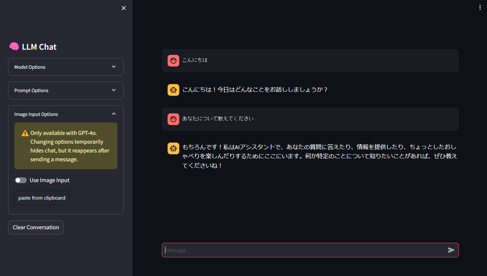

# Streamlit LLM API

## Overview

A Streamlit app that provides a closed and authenticated way to use free LLM APIs in a chat format.

## Environment Setup

Create a container from VSCode's Dev Containers.

## Setup Instructions

1. Use the `.env.sample` file as a reference to create a `.env` file. Set your LLM API key and login information in this file.

2. Execute the following command to start the application:
   ```
   streamlit run app.py
   ```

## How to Use

* Once the application is launched, you can start a conversation through the web interface.
* The left panel allows you to select different LLM models.


